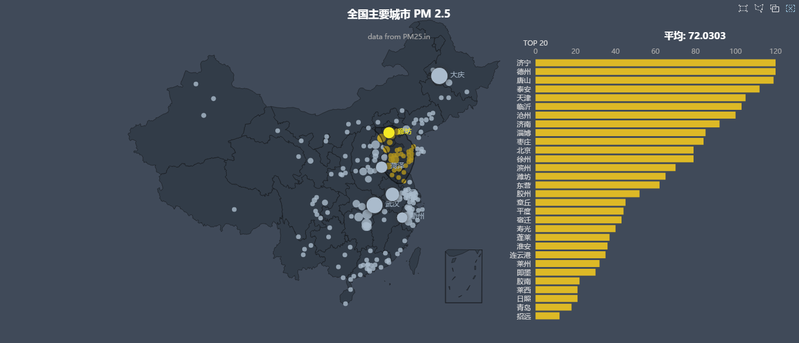
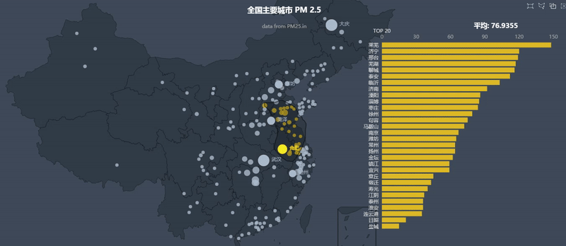

# Nodejs 爬虫 PM2.5 数据可视化处理

**注意:**

在根目录下执行 npm install 或者 yarn install（如果有装yarn的话）安装依赖

可以先删掉 data\\html 文件夹里面的内容，否则将会一直得到缓存数据

再执行 node app.js 启动程序

然后在浏览器输入 localhost:8000 就可以看到页面了

### 下面是实际的演示:  

### 静态

### 动态

=======
